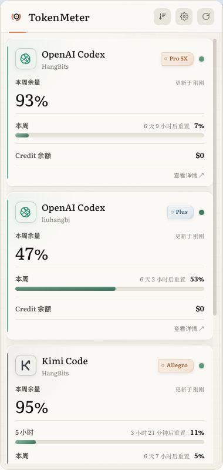
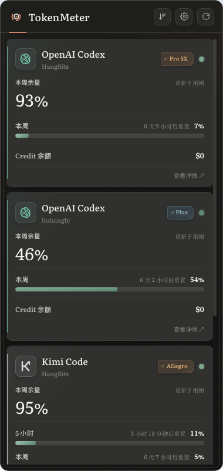

# TokenMeter

一眼看清所有 AI 账户余量的菜单栏小组件。

没有主窗口、不打断工作流——状态栏一点、悬浮球一瞥，套餐余量、API 余额、重置倒计时全在手上。



## 为什么用 TokenMeter

### 🪟 无窗口模式，随时掌握

没有需要管理的主窗口。macOS 菜单栏 / Windows 托盘常驻，点击展开面板；桌面悬浮球以水位线实时呈现各账户余量，瞄一眼就知道还能用多少，不用时收成一颗小球安静待在屏幕边缘。

### 🧩 多平台接入，一个面板全掌握

OpenAI Codex、Claude、Kimi、DeepSeek、Gemini、GLM、MiniMax、OpenRouter、火山引擎、SiliconFlow……订阅套餐和按量 API 统一成一套语言：余量百分比、余额、重置倒计时。17 个平台接口持续增加，新平台只需字段映射即可接入。

### 🎨 三套主题，三种质感

Classic 的苹果原生清透、Claude 的羊皮纸温润、Cyber 的赛博光影，风格与明暗外观独立组合，连悬浮球都有各自的设计语言。

### 🆓 桌面端完全免费

macOS（Apple Silicon / Intel）与 Windows 全部功能免费开放，MIT 协议。iOS 移动端规划中。

## 界面预览

| 面板 · 浅色 | 面板 · 深色 | 桌面悬浮球 |
|------------|------------|-----------|
|  |  |  |

## 支持平台

| 平台 | 类型 | 数据来源 | 状态 |
|------|------|---------|------|
| OpenAI Codex | 订阅（5h/7d 额度 + Credit） | OAuth / 本机 CLI | ✅ |
| OpenAI Platform | 按量（花费 + token 用量） | Admin API Key | ✅ |
| Claude | 订阅（5h/7d/Extra Usage） | OAuth / 本机 Claude Code | 🧪 待套餐账号实测 |
| Anthropic API | 按量（成本 + token 用量） | Admin API Key | ✅ |
| OpenRouter | 按量（Credits + Key 预算） | OAuth / API Key | ✅ |
| Kimi Code | 订阅（5h/周/Extra Usage） | 设备码 OAuth / 本机 CLI | ✅ |
| Moonshot | 按量余额 | API Key | ✅ |
| DeepSeek | 按量余额 | API Key | ✅ |
| GLM Coding Plan | 订阅（5h/周/MCP） | Coding Plan API Key | 🧪 待套餐账号实测 |
| GLM API | 按量（现金 + 资源包） | API Key | ✅ |
| MiniMax Token Plan | 订阅（多模态额度） | Subscription Key / 本机 CLI | 🧪 待套餐账号实测 |
| MiniMax API | 按量余额 | API Key | ✅ |
| 腾讯 TokenHub | Token Plan（按总量扣减） | SecretId/Key | ✅ |
| Gemini Code Assist | 订阅（模型配额 + AI Credits） | Google OAuth / 本机 Gemini CLI | 🧪 待套餐账号实测 |
| 火山引擎 | 按量（可用/现金/信用/冻结/欠费） | 费用中心 Access Key / Secret Key | 🧪 待真实账号实测 |
| SiliconFlow | 按量（总余额 + 充值/赠送余额） | API Key（国内/国际站） | 🧪 待真实账号实测 |
| 腾讯 Token Plan（个人版） | 订阅 | 无官方查询 API | 🔜 待官方开放 |
| 腾讯 Coding Plan | 订阅 | 无官方 API | 🔜 待官方开放 |

### 路线图（计划接入）

| 平台 | 备注 |
|------|------|
| 小米 MiMo | 小米大模型 API |
| Ali Qwen (通义千问) | 阿里云百炼 API |

> 完整开发顺序见 [docs/06-roadmap.md](docs/06-roadmap.md)，各平台接口调研与字段确认记录见 [docs/01-provider-matrix.md](docs/01-provider-matrix.md)。欢迎 PR 补充。

## 更多特性

- **卡片排序**：上下箭头自定义顺序，持久化记忆
- **自适应高度**：内容少时紧凑，多了才滚动
- **添加供应商向导**：API Key 表单 / OAuth 浏览器授权 / 本机 CLI 凭证一键导入
- **凭证安全**：AES-256-GCM 加密存储，token 过期自动刷新
- **后台刷新**：间隔可调（1–30 分钟），打开面板立即刷新
- **自动更新**：自动检测、下载，一键升级重启
- **开机启动**：可选
- **零数据库**：除配置文件外不产生本地数据，用量曲线点"查看详情"跳官方控制台

## 安装

从 [Releases](https://github.com/liuhangbj/TokenMeter/releases) 下载：

| 平台 | 文件 |
|------|------|
| macOS (Apple Silicon) | `TokenMeter_x.x.x_aarch64.dmg` |
| macOS (Intel) | `TokenMeter_x.x.x_x64.dmg` |
| Windows (MSI) | `TokenMeter_x.x.x_x64_en-US.msi` |
| Windows (NSIS) | `TokenMeter_x.x.x_x64-setup.exe` |

> ⚠️ 当前版本未做代码签名：macOS 首次打开需在「系统设置 → 隐私与安全性」允许；Windows 可能提示 SmartScreen，选"仍要运行"。

## 开发

技术栈：**Tauri 2 + Rust + React + TypeScript + Vite**

```bash
# 依赖：Rust (rustup)、Node.js 22+
npm install
npx tauri dev        # 开发模式（热更新）
npx tauri build      # 构建安装包
```

### 本机测试构建 / 部署

```bash
scripts/dev-deploy.sh               # debug 构建 → 部署 → 直接启动 App
scripts/dev-deploy.sh --install     # 构建并安装到 ~/Applications/TokenMeter Dev.app
scripts/dev-deploy.sh --release     # release 构建
scripts/dev-deploy.sh --no-run      # 只构建不启动
scripts/dev-deploy.sh --isolate     # 独立数据目录，不影响正式版凭证/设置
```

- 产物：`src-tauri/target/<profile>/tokenmeter` 与 `.../bundle/macos/TokenMeter.app`
- 启动日志：`/tmp/tokenmeter-dev.log`；停止：`kill $(cat /tmp/tokenmeter-dev.pid)`
- 本机没有签名私钥时自动跳过 updater 签名产物；正式发布仍走 GitHub Actions
- 测试前请先退出正式版 TokenMeter（单实例锁会让第二个实例直接退出）

### 架构（三层）

```text
src/                         # UI 层：React + TypeScript（平台无关）
├── App.tsx                  # 托盘面板（单窗口，含内嵌添加供应商向导）
├── ProviderCard.tsx         # 标准卡片渲染器（无供应商分支）
└── SettingsPanel.tsx        # 设置面板

src-tauri/src/
├── core/                    # Core 层：平台无关核心（不依赖 Tauri）
│   ├── providers/           # Provider trait + 字段/套餐/卡片映射
│   ├── store.rs             # AES-256-GCM 加密凭证存储
│   ├── scheduler.rs         # 定时/触发刷新（并发 + 失败可见）
│   ├── scheduler_ctl.rs     # 刷新间隔广播 + 立即刷新信号
│   ├── settings.rs          # 设置文件持久化
│   └── oauth_codex.rs       # Codex PKCE / Kimi 设备码 OAuth
├── platform/                # Platform Shell：平台差异集中地
│   ├── tray.rs              # 托盘/菜单栏（macOS 顶部、Windows 任务栏）
│   ├── floating_orb.rs      # 桌面悬浮球（水位线/收起/多主题）
│   └── mod.rs               # macOS Accessory 策略、系统浏览器打开
├── commands.rs              # IPC 薄层（前端 ↔ core/platform）
└── main.rs                  # 组装根：插件、窗口事件、退出守卫
```

### 设计原则

- **三层边界**：Core 不感知 Tauri；平台差异（托盘、焦点、Dock、浏览器）只允许出现在 `platform/`；UI 只通过 commands 与后端对话
- **单窗口**：全 App 只有一个 WebView（托盘面板），添加供应商/设置都是面板内视图——规避 Windows WebView2 多窗口白屏/冻结
- **零数据库**：不存历史、不做统计，实时拉取实时显示，用量曲线跳官方控制台看
- **凭证不落明文**：AES-256-GCM 加密，随机主密钥 0600 独立存放（无签名环境的现实折中）
- **数据驱动 UI**：provider 声明 `auth_spec`，向导表单自动渲染，加新平台只需实现一个 trait

## License

[MIT](LICENSE)
